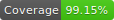
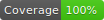
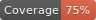

# Foreyes
## 📺 Compare how your webpage looks in different browsers! 📺

[](https://travis-ci.com/Typeform/Foreyes)





We want to ensure our design is consistent across our supported browsers. Sadly, this is typically done in a manual fashion. Foreyes aims to fix that problem.

Here's how it works: Foreyes screenshoots a webpage in a baseline browser (the one where we usually develop), and then compares it with the screenshots of other browsers. Then announce the pixel differences, if any!

The currently supported browsers are Chrome (as the baseline), Firefox, and IE11 (through Browserstack).

## Getting Started

### Prerequisites

Foreyes is a CLI tool that uses `node.js` and `yarn`; so ensure they are installed. And because Foreyes uses Selenium, have the latest `Java` installed, too.

Additionally, at the moment IE11 is run on Browserstack. Be sure to export these ENV vars if you wish to use it.
```
BROWSERSTACK_USERNAME
BROWSERSTACK_KEY
```

### Installing

Use yarn to add the package:

```bash
yarn add @typeform/foreyes
```

Foreyes has the following command to easily create the necessary config files (under `foreyesConfig`):

```bash
yarn foreyes setup
```

## Running

Foreyes can visually compare URLs directly. Add URLs to the list at `foreyesConfig/fixturesUrls.json`. Then use `yarn foreyes test-urls` to run them.

There are 3 byproducts of a test execution:
1. Information on the command line, including the percentage of difference between browsers.
2. Screenshots (original, and difference) under the screenshots folder.
3. A pretty HTML report in `foreyesConfig/report/index.html`

These tools can be very useful in diagnosing why exactly the execution has failed.

## Other uses

There are other ways to use Foreyes.

### Testing a design system

Originally, Foreyes was designed to work with Design Systems! It has since become a more flexible tool; however that functionality is still there, maintained.

So, if you're interested in visually comparing specific mounted components, check out this [cool guide!](./TESTING-DESIGN-SYSTEM.md)

### CI (Travis)

Travis has to work with Java (for Selenium), and have Chrome and Firefox (and their drivers) available. Foreyes will download most of these things as dependencies, but not all of them.

Therefore, add in .travis.yml:

```yml
addons:
  chrome: stable

before_install:
  - export MOZ_HEADLESS=1

script:
  - yarn foreyes test-urls
```

## Contributing

Head over to [CONTRIBUTING.md](CONTRIBUTING.md) for more information

## Authors

Refer to one of the authors for help and issues.

* **Daniel Giralt Len** - *Coordinator and Developer*
* **Jordi Pons Llauradó** - *Developer*
* **Toni Feliu** - *Developer*
* **Pau Boix** - *Developer*

## License

This code's license is [Apache-2.0](LICENSE-2.0.txt)